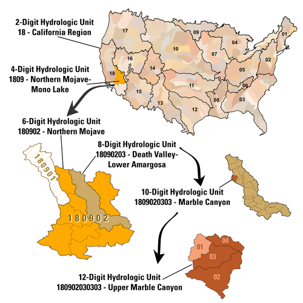

# Open Source Geospatial data that costs free dollars
*Free data sources, mostly geospatial*

### Climate Data
- [NOAA historical climate data](https://www.ncdc.noaa.gov/cdo-web/search)

### Topo Data
- [List of Resources from Carleton College](https://serc.carleton.edu/NAGTWorkshops/gis/topographic_data.html)
- [GISGeography's DEM Sources](https://gisgeography.com/free-global-dem-data-sources/)

### Socioeconomic Data
- [Socioeconomic Data and Applications Center](https://sedac.ciesin.columbia.edu/)
- [Perry-Castaneda Map Collection at UT Austin](http://legacy.lib.utexas.edu/maps/)

### Admin Areas and Boundaries
- [World Administrative Areas](https://www.gadm.org/data.html)
- [U.N. Second Admin. Level Boundaries](https://www.unsalb.org/)
- [World Borders Dataset - kml based, has JS API](http://thematicmapping.org/downloads/world_borders.php)

### Multi-Feature
- [Natural Earth](https://www.naturalearthdata.com/)

### Environmental and Natural Resource Data
- [USDA's geospatial data gateway](https://gdg.sc.egov.usda.gov/GDGHome.aspx)
- [U.S. Fish and Wildlife Service Catalog](https://ecos.fws.gov/ServCat/)
- [Bureau of Land Management](https://www.blm.gov/services/geospatial/GISData)
- [National Hydrology Dataset Info](https://nhd.usgs.gov/userGuide/Robohelpfiles/NHD_User_Guide/Feature_Catalog/NHD_Feature_Catalog.htm)
- [U.S. Environmental Protection Agency Open Data Catalog](https://edg.epa.gov/metadata/catalog/main/home.page)

### Location-Specific

#### Colorado
- [Colorado's Decision Support Systems](https://www.colorado.gov/cdss)

#### Texas
- [Texas Natural Resources Information System](https://data.tnris.org/)

### Diagrams

